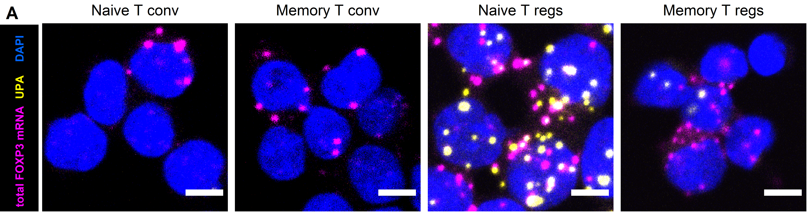
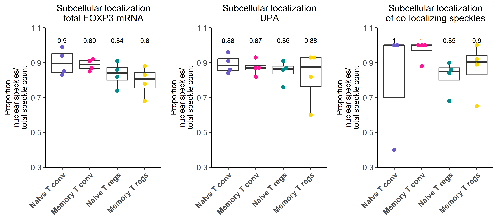
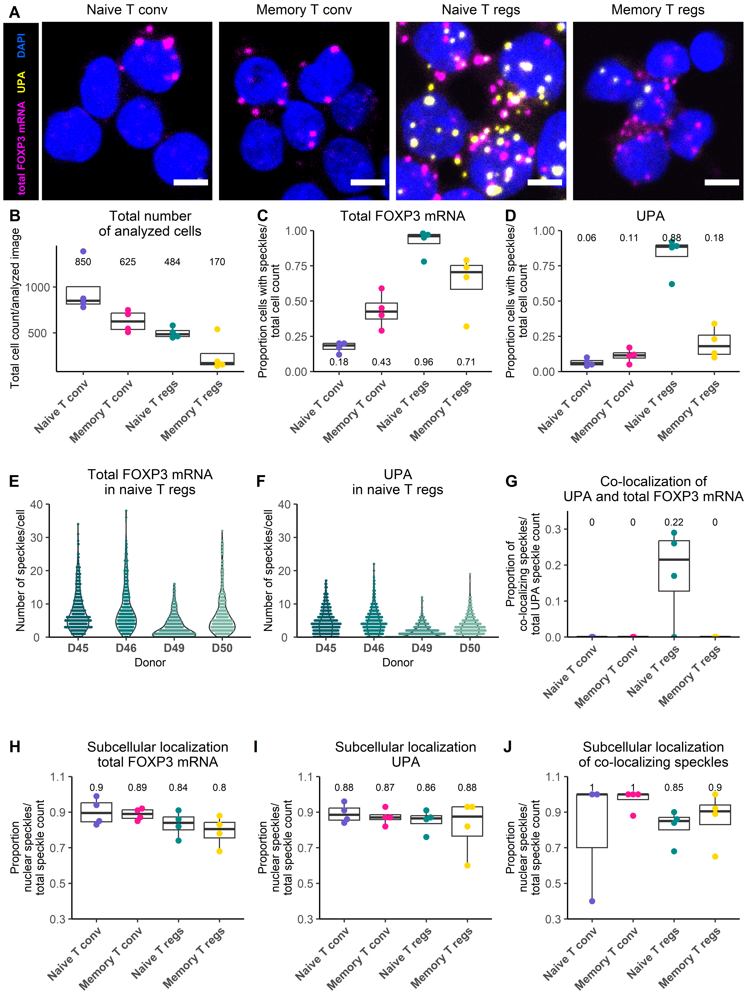

## Libraries


```r
library(rlang)
library(plyr)
library(dplyr)
library(ggplot2)
library(ggpubr)
library(readr)
library(ggridges)
library(rstatix)
library(ggbeeswarm)
library(reshape2)
library(base)
library(png)
library(xlsx)
library(stringr)
library(here)
```

## Parameters & directories


```r
cols <- c("slateblue", "deeppink", "darkcyan", "gold", "navy", "darkorange", "mediumseagreen", "brown2")

cols_donors <- hcl.colors(6, "Mint")[1:4]

#Create the output folder for subsequent data export
output_dir <- here::here("Spot_colocalization_analysis_files") 
dir.create(output_dir)


# Define path to the folder with the example images 
dir_example_images <- "D:/Repositories/2024_Cases_et_al/data/example_images_regions/"

# Define path to folder with the raw data csv files from CellProfiler 
dir_raw_data <- "D:/Repositories/2024_Cases_et_al/data/raw_data_CellProfiler"
```

# Example images

## Figure 5A

Load images:


```r
# load image
img <- readPNG(paste0(dir_example_images, "1_naiveTconv.tiff.png"))

plot_1 <- ggplot() + background_image(img)+
  theme_void()+
  theme(plot.margin=margin(0.1,0.1,0.1,0.1,"cm"),
         plot.title = element_text(size=20),legend.text=element_text(size=20))#+
  # annotate("text", x=1.5, y=1.5, label= "ROI1",
  #          col="white", size=10, parse=TRUE)
plot_1<- annotate_figure(plot_1,
               top = text_grob("Naive T conv", color = "black", size = 12))


# load image ----------------------------------------------
img <- readPNG(paste0(dir_example_images, "2_memoryTconv.tiff.png"))

plot_2 <- ggplot() + background_image(img)+
  theme_void()+
  theme(plot.margin=margin(0.1,0.1,0.1,0.1,"cm"),
         plot.title = element_text(size=20),legend.text=element_text(size=20))#+
  # annotate("text", x=1.5, y=1.5, label= "ROI1",
  #          col="white", size=10, parse=TRUE)
plot_2<- annotate_figure(plot_2,
               top = text_grob("Memory T conv", color = "black", size = 12))


# load image----------------------------------------------
img <- readPNG(paste0(dir_example_images, "3_naiveTreg.tiff.png"))

plot_3 <- ggplot() + background_image(img)+
  theme_void()+
  theme(plot.margin=margin(0.1,0.1,0.1,0.1,"cm"),
         plot.title = element_text(size=20),legend.text=element_text(size=20))#+
  # annotate("text", x=1.5, y=1.5, label= "ROI1",
  #          col="white", size=10, parse=TRUE)
plot_3<- annotate_figure(plot_3,
               top = text_grob("Naive T regs", color = "black", size = 12))


# load image----------------------------------------------
img <- readPNG(paste0(dir_example_images, "4_memoryTreg.tiff.png"))

plot_4 <- ggplot() + background_image(img)+
  theme_void()+
  theme(plot.margin=margin(0.1,0.1,0.1,0.1,"cm"),
         plot.title = element_text(size=20),legend.text=element_text(size=20))#+
  # annotate("text", x=1.5, y=1.5, label= "ROI1",
  #          col="white", size=10, parse=TRUE)
plot_4<- annotate_figure(plot_4,
               top = text_grob("Memory T regs", color = "black", size = 12))


# add legend with colors
img <- readPNG(paste0(dir_example_images, "black_background.png"))

plot_cols <- ggplot() + background_image(img)+
  theme_void()+
  theme(plot.margin=margin(0,0,0,0,"cm"),
        plot.title = element_text(size=10),legend.text=element_text(size=10))+
  annotate("text", x=1.5, y=c(1.1, 2, 2.5), 
           label= c("total FOXP3 mRNA", "UPA", "DAPI"),
           fontface = 2, 
           angle = 90,
           col=c("magenta", "yellow", "#0066FF"),
           size=9/.pt, parse=FALSE, 
           ymin = 0.5, ymax = 2.7)+
  theme(plot.margin=margin(0.7,0,0.1,0,"cm"))


plot_images <- ggarrange(plot_cols, plot_1, plot_2, plot_3, plot_4, ncol = 5, 
                         widths = c(0.6, 3, 3, 3, 3), labels = c("A"))
plot_images
```



# Number of cells analyzed per image

## Import data & data tidying


```r
# load all Image.csv file from the CellProfiler output folder and combine them in one data table
file_list <- list.files(path=dir_raw_data, 
                         pattern="_Image.csv", all.files=FALSE,
                         full.names=FALSE)

df <- data.frame()

for (file in file_list) {
  dir <- paste0(dir_raw_data , "/", file)
  df_sub <- read_csv(dir)
  info <- c(strsplit(file, "_"))
  df_sub$Image <- gsub("_Image.csv", "", file)
  df_sub$Donor <- substring(file, 1, 3)
  df_sub$CellType <- substring(file, 14, 14)
  df <- rbind(df, df_sub)  
  
}

df_cells <- df %>%
  select(Donor, CellType, Image, Count_cells, 
         Count_FoxP3_speckles_inside_cells, Count_FoxP3_speckles_inside_nuclei, 
         Count_UPA_speckles_inside_cells, Count_UPA_speckles_inside_nuclei, 
         Count_colocalizing_spots_intracellular,
         Count_colocalizing_spots_intranuclear) %>%
  mutate(TcellType=recode(CellType, 
                          `1`="Naive T conv", 
                          `2`="Memory T conv", 
                          `3`="Naive T regs", 
                          `4`="Memory T regs"))
colnames(df_cells) <- gsub("Count_cells", "Cell count", colnames(df_cells))

df_cells$TcellType <- factor(df_cells$TcellType, levels = c(
  "Naive T conv", 
  "Memory T conv", 
  "Naive T regs", 
  "Memory T regs"
))
```

## Figure 5B - Analyzed number of cells


```r
# per cells -----------------------------------------------------------------

# Create labels that depict mean value 
Labs = df_cells %>% 
  group_by(TcellType ) %>%
  summarise(lab_text = paste0(round(median(`Cell count`), 0)), lab_pos = 1200
              )


plot_cells <- ggplot(df_cells, aes(x = CellType, y = `Cell count`, fill = "CellType"))+
  geom_boxplot(outlier.colour = "grey",
               outlier.size = 0.5)+
  geom_beeswarm(aes(color = CellType), size = 2, cex = 3)+
  ggtitle("Total number of analyzed cells") +
  theme_classic2()+
  theme(axis.text.x = element_text(#angle = 50, 
                                   vjust = 1, size = 12, hjust = 0.5, face = "bold"),
        axis.text.y = element_text(hjust = 0.5, size = 12),
        axis.title.x = element_text(size = 12),
        axis.title.y = element_text(size = 12),
        plot.title = element_text(size =14, hjust = 0.5),
        legend.title = element_text(size =14),
        legend.text = element_text(size =12), 
        legend.position = "none")+
  scale_fill_manual(values = "white")+
  scale_color_manual(values = cols)+
  theme(plot.margin = margin(0.1, 5, 0.1, 5, "cm"))


plot_cells <- ggplot(df_cells, aes(x = TcellType, y = `Cell count`, fill = "CellType"))+
  geom_boxplot(outlier.colour = "grey",
               outlier.size = 0.5)+
  geom_beeswarm(aes(color = TcellType), size = 2, cex = 3)+
  ggtitle("Total number\nof analyzed cells") +
  ylab("Total cell count/analyzed image")+
  theme_classic2()+
  theme(axis.text.x = element_text(angle = 45, 
                                   vjust = 1, size = 10, hjust = 1, face = "bold"),
        axis.text.y = element_text(hjust = 0.5, size = 10),
        axis.title.x = element_blank(),
        axis.title.y = element_text(size = 10),
        plot.title = element_text(size =12, hjust = 0.5),
        legend.title = element_text(size =12),
        legend.text = element_text(size =10), 
        legend.position = "none")+
  scale_fill_manual(values = "white")+
  scale_color_manual(values = cols)+
  geom_text(aes(y = lab_pos, label = lab_text, vjust = -0.5), data = Labs,size=3)
```

Export to Excel file:


```r
library(xlsx)

df_export <- df_cells %>%
  select(Donor, TcellType, `Cell count`) 

write.xlsx(df_export, file=paste0(output_dir, "/Data_Figure_5.xlsx"), sheetName="Fig_5B")
```

# Proportion of cells with speckles

## Import data & data tidying


```r
# load all cells.csv file from the CellProfiler output folder and combine them in one data table
file_list <- list.files(path=dir_raw_data, 
                         pattern="_cells.csv", all.files=FALSE,
                         full.names=FALSE)

df_spot <- data.frame()

for (file in file_list) {
  dir <- paste0( dir_raw_data, "/", file)
  df_sub <- read_csv(dir, 
      col_types = cols(...1 = col_skip()))
  info <- c(strsplit(file, "_"))
  df_sub$Image <- gsub("_cells.csv", "", file)
  df_sub$Donor <- substring(file, 1, 3)
  df_sub$CellType <- substring(file, 14, 14)

  df_spot <- rbind(df_spot, df_sub)  
  
}

df_spot$FileName_raw_image <- gsub(".tiff", "", df_spot$FileName_raw_image)

colnames(df_spot) <- gsub("Children_", "", colnames(df_spot))
colnames(df_spot) <- gsub("_in_cells_Count", "", colnames(df_spot))
colnames(df_spot) <- gsub("Location_Center", "Coord", colnames(df_spot))

df_spot <- df_spot %>%
  mutate(TcellType=recode(CellType, 
                          `1`="Naive T conv", 
                          `2`="Memory T conv", 
                          `3`="Naive T regs", 
                          `4`="Memory T regs")) %>%
  select(-c(PathName_raw_image, ImageNumber, FileName_raw_image))

df_spot$ObjectNumber <- 1:nrow(df_spot)
```

### Foxp3 speckles


```r
# Calculate the number of cells that have foxp3 speckles

df_spot_fox <- df_spot %>%
  mutate(Sum_spots_fox = FoxP3_speckles_Count)

for (rownumber in 1:nrow(df_spot_fox)) {
  number_of_spots <- df_spot_fox$Sum_spots_fox[rownumber]
  if (number_of_spots == 0) {
    df_spot_fox$Empty[rownumber] <- TRUE
  } else if (number_of_spots > 0) {
    df_spot_fox$Empty[rownumber] <- FALSE
  } 
}


df_prob_fox <- df_spot_fox %>%
  group_by(Image, TcellType, Empty) %>%
  tally()


# df with the quantification of empty cells
df_empty_cells_fox <- df_prob_fox %>%
  filter(Empty == TRUE) %>%
  mutate(`Empty cells` = n, 
         Type = "FoxP3") %>%
  select(-Empty, -n)


# df with quantification of cells with spots
df_speckle_cells_fox <- df_prob_fox %>%
  filter(Empty == FALSE) %>%
  mutate(`Speckle cells` = n, 
         Type = "FoxP3") %>%
  select(-Empty, -n)

df_fox <- merge(df_speckle_cells_fox, df_empty_cells_fox)
df_fox <- df_fox %>%
  mutate(TotalCells = `Speckle cells`+`Empty cells`, 
         Prop_empty = round(`Empty cells`/TotalCells, 2), 
         Prop_speckle_cells = round(`Speckle cells`/TotalCells, 2))

df_fox$TcellType <- factor(df_fox$TcellType, levels = c(
  "Naive T conv", 
  "Memory T conv", 
  "Naive T regs", 
  "Memory T regs"
  ))
```

### UPA speckles


```r
# Calculate the number of cells that have foxp3 speckles

df_spot_upa <- df_spot %>%
  mutate(Sum_spots_upa = UPA_speckles_Count)

for (rownumber in 1:nrow(df_spot_upa)) {
  number_of_spots <- df_spot_upa$Sum_spots_upa[rownumber]
  if (number_of_spots == 0) {
    df_spot_upa$Empty[rownumber] <- TRUE
  } else if (number_of_spots > 0) {
    df_spot_upa$Empty[rownumber] <- FALSE
  } 
}


df_prob_upa <- df_spot_upa %>%
  group_by(Image, TcellType, Empty) %>%
  tally()

head(df_prob_upa)
```

```
## # A tibble: 6 × 4
## # Groups:   Image, TcellType [3]
##   Image          TcellType     Empty     n
##   <chr>          <chr>         <lgl> <int>
## 1 D45_expanded_1 Naive T conv  FALSE    86
## 2 D45_expanded_1 Naive T conv  TRUE    789
## 3 D45_expanded_2 Memory T conv FALSE    61
## 4 D45_expanded_2 Memory T conv TRUE    485
## 5 D45_expanded_3 Naive T regs  FALSE   514
## 6 D45_expanded_3 Naive T regs  TRUE     66
```

```r
# df with the quantification of empty cells
df_empty_cells_upa <- df_prob_upa %>%
  filter(Empty == TRUE) %>%
  mutate(`Empty cells` = n, 
         Type = "UPA") %>%
  select(-Empty, -n)

# df with quantification of cells with spots
df_speckle_cells_upa <- df_prob_upa %>%
  filter(Empty == FALSE) %>%
  mutate(`Speckle cells` = n, 
         Type = "UPA") %>%
  select(-Empty, -n)

df_upa <- merge(df_speckle_cells_upa, df_empty_cells_upa)
df_upa <- df_upa %>%
  mutate(TotalCells = `Speckle cells`+`Empty cells`, 
         Prop_empty = round(`Empty cells`/TotalCells, 2), 
         Prop_speckle_cells = round(`Speckle cells`/TotalCells, 2))

df_upa$TcellType <- factor(df_upa$TcellType, levels = c("Naive T conv", 
                                              "Memory T conv", 
                                              "Naive T regs", 
                                              "Memory T regs")) 
```

Combine UPA and FoxP3


```r
df_all_speckles <- rbind(df_fox, df_upa)
```

## Figure 5C - totalFOXP3 speckles


```r
# Create labels that depict mean value
Labs = df_fox %>%
  group_by(TcellType ) %>%
  summarise(lab_text = paste0(round(median(Prop_speckle_cells), 2)), lab_pos = 0.02
              )


plot_cells_fox <- ggplot(df_fox, aes(x = TcellType, y = Prop_speckle_cells, fill = "TcellType"))+
  geom_boxplot(outlier.colour = "grey",
               outlier.size = 0.5)+
  geom_beeswarm(aes(color = TcellType), size = 2, cex = 3)+
  ggtitle("Total FOXP3 mRNA") +
  ylab("Proportion cells with speckles/\ntotal cell count")+
  scale_y_continuous(expand = c(0, 0), limits = c(0, 1))+
  theme_classic2()+
  theme(axis.text.x = element_text(angle = 45, 
                                   vjust = 1, size = 10, hjust = 1, face = "bold"),
        axis.text.y = element_text(hjust = 0.5, size = 10),
        axis.title.x = element_blank(),
        axis.title.y = element_text(size = 10),
        plot.title = element_text(size =12, hjust = 0.5),
        legend.title = element_text(size =12),
        legend.text = element_text(size =10), 
        legend.position = "none")+
  scale_fill_manual(values = "white")+
  scale_color_manual(values = cols)+
  geom_text(aes(y = lab_pos, label = lab_text, vjust = -0.5), data = Labs,size=3)
```

Export data as excel file:


```r
df_export <- df_fox %>%
  mutate(Donor = str_extract(Image, pattern = "[^_]*")) %>%
  select(Donor, TcellType, Prop_speckle_cells) 

write.xlsx(df_export, file=paste0(output_dir, "/Data_Figure_5.xlsx"), sheetName="Fig_5C", append = TRUE)
```

## Figure 5D - UPA speckles


```r
# Create labels that depict mean value
Labs = df_upa %>%
  group_by(TcellType ) %>%
  summarise(lab_text = paste0(round(median(Prop_speckle_cells), 2)), lab_pos = 0.90
              )


plot_cells_upa <- ggplot(df_upa, aes(x = TcellType, y = Prop_speckle_cells, fill = "TcellType"))+
  geom_boxplot(outlier.colour = "grey",
               outlier.size = 0.5)+
  geom_beeswarm(aes(color = TcellType), size = 2, cex = 3)+
  ggtitle("UPA") +
  ylab("Proportion cells with speckles/\ntotal cell count")+
  scale_y_continuous(expand = c(0, 0), limits = c(0, 1))+
  theme_classic2()+
  theme(axis.text.x = element_text(angle = 45, 
                                   vjust = 1, size = 10, hjust = 1, face = "bold"),
        axis.text.y = element_text(hjust = 0.5, size = 10),
        axis.title.x = element_blank(),
        axis.title.y = element_text(size = 10),
        plot.title = element_text(size =12, hjust = 0.5),
        legend.title = element_text(size =12),
        legend.text = element_text(size =10), 
        legend.position = "none")+
  scale_fill_manual(values = "white")+
  scale_color_manual(values = cols)+
  geom_text(aes(y = lab_pos, label = lab_text, vjust = -0.5), data = Labs,size=3)
```

Export as Excel file:


```r
df_export <- df_upa %>%
  mutate(Donor = str_extract(Image, pattern = "[^_]*")) %>%
  select(Donor, TcellType, Prop_speckle_cells) 

write.xlsx(df_export, file=paste0(output_dir, "/Data_Figure_5.xlsx"), sheetName="Fig_5D", append = TRUE)
```


```r
ggarrange(plot_cells_fox, plot_cells_upa, ncol = 2)
```


# Analyze the total number of speckles per cell for naive T regs

## Figure 5E & F


```r
df_tregs <- df_spot %>%
  filter(TcellType == "Naive T regs")

df_tregs$Donor <- factor(df_tregs$Donor, levels = c("D45", "D46", "D49", "D50")) 


# Create labels that depict mean value
Labs = df_tregs %>%
  group_by(Donor ) %>%
  summarise(lab_text = paste0(round(median(FoxP3_speckles_Count), 0)), lab_pos = 38
              )

# FoxP3
plot_tregs_fox <- ggplot(df_tregs, aes(x = Donor, y = FoxP3_speckles_Count, fill = "Donor"))+
  geom_violin(trim = TRUE)+
  geom_beeswarm(aes(color = Donor), size = 0.5, cex = 0.2)+
  ggtitle("Total FOXP3 mRNA\nin naive T regs") +
  ylab("\nNumber of speckles/cell")+
  xlab("Donor")+
  scale_y_continuous(expand = c(0, 0), limits = c(0, 40))+
  theme_classic2()+
  theme(axis.text.x = element_text(#angle = 45, 
                                   vjust = 1, size = 10, hjust = 0.5, face = "bold"),
        axis.text.y = element_text(hjust = 0.5, size = 10),
        axis.title.x = element_text(size = 10),
        axis.title.y = element_text(size = 10),
        plot.title = element_text(size =12, hjust = 0.5),
        legend.title = element_text(size =12),
        legend.text = element_text(size =10), 
        legend.position = "none")+
  scale_fill_manual(values = "white")+
  scale_color_manual(values = alpha(cols_donors, 0.7))+
  # geom_text(aes(y = lab_pos, label = lab_text, vjust = -0.5), data = Labs,size=3) +
  theme(plot.margin = margin(0, 0, 0, 0.1, "cm"))


# Create labels that depict mean value
Labs = df_tregs %>%
  group_by(Donor ) %>%
  summarise(lab_text = paste0(round(median(UPA_speckles_Count), 0)), lab_pos = 38
              )

# UPA
plot_tregs_upa <- ggplot(df_tregs, aes(x = Donor, y = UPA_speckles_Count, fill = "Donor"))+
  geom_violin(trim = TRUE)+
  geom_beeswarm(aes(color = Donor), size = 0.5, cex = 0.2)+
  ggtitle("UPA\nin naive T regs") +
  ylab("\nNumber of speckles/cell")+
  xlab("Donor")+
  scale_y_continuous(expand = c(0, 0), limits = c(0, 40))+
  theme_classic2()+
  theme(axis.text.x = element_text(#angle = 45, 
                                   vjust = 1, size = 10, hjust = 0.5, face = "bold"),
        axis.text.y = element_text(hjust = 0.5, size = 10),
        axis.title.x = element_text(size = 10),
        axis.title.y = element_text(size = 10),
        plot.title = element_text(size =12, hjust = 0.5),
        legend.title = element_text(size =12),
        legend.text = element_text(size =10), 
        legend.position = "none")+
  scale_fill_manual(values = "white")+
  scale_color_manual(values = alpha(cols_donors, 0.7))+
  # geom_text(aes(y = lab_pos, label = lab_text, vjust = -0.5), data = Labs,size=3) +
  theme(plot.margin = margin(0, 0, 0, 0.1, "cm"))

# Combine both plots to figure
figure <- ggarrange(plot_tregs_fox, plot_tregs_upa, ncol = 2)

annotate_figure(figure,
               top = text_grob("Naive Tregs", 
                               color = "black", 
                               face = "bold", 
                               size = 14)) +
  theme(plot.margin = margin(0, 0.1, 0, 0.1, "cm"))
```


```r
df_export <- df_tregs %>%
  select(Donor, TcellType, FoxP3_speckles_Count, UPA_speckles_Count) 

write.xlsx(df_export, file=paste0(output_dir, "/Data_Figure_5.xlsx"), sheetName="Fig_5E&F", append = TRUE)
```

# Proportion of co-localizing spots

## Figure 5G


```r
df_colo <- df_spot %>%
  filter(UPA_speckles_Count != 0) %>%
  mutate(prop_coloc_to_upa = colocalizing_spots/UPA_speckles_Count) %>%
  group_by(Image, TcellType) %>%
  summarize(Median_prop = round(median(prop_coloc_to_upa), 2))

df_colo$TcellType <- factor(df_colo$TcellType, levels = c(
  "Naive T conv", 
  "Memory T conv", 
  "Naive T regs", 
  "Memory T regs"
  )) 

head(df_colo)
```

```
## # A tibble: 6 × 3
## # Groups:   Image [6]
##   Image          TcellType     Median_prop
##   <chr>          <fct>               <dbl>
## 1 D45_expanded_1 Naive T conv         0   
## 2 D45_expanded_2 Memory T conv        0   
## 3 D45_expanded_3 Naive T regs         0.26
## 4 D45_expanded_4 Memory T regs        0   
## 5 D46_expanded_1 Naive T conv         0   
## 6 D46_expanded_2 Memory T conv        0
```

```r
# Create labels that depict mean value
Labs = df_colo %>%
  group_by(TcellType ) %>%
  summarise(lab_text = paste0(round(median(Median_prop, na.rm = TRUE), 2)), lab_pos = 0.3)


plot_cells_coloc_prop <- ggplot(df_colo, aes(x = TcellType, y = Median_prop, fill = "TcellType"))+
  geom_boxplot(outlier.colour = "grey",
               outlier.size = 0.5)+
  geom_beeswarm(aes(color = TcellType), size = 2, cex = 0.3)+
  ggtitle("Co-localization of\nUPA and total FOXP3 mRNA") +
  ylab("Proportion of\nco-localizing speckles/\ntotal UPA speckle count")+
  scale_y_continuous(expand = c(0, 0), limits = c(0, 0.35))+
  theme_classic2()+
  theme(axis.text.x = element_text(angle = 45, 
                                   vjust = 1, size = 10, hjust = 1, face = "bold"),
        axis.text.y = element_text(hjust = 0.5, size = 10),
        axis.title.x = element_blank(),
        axis.title.y = element_text(size = 10),
        plot.title = element_text(size =12, hjust = 0.5),
        legend.title = element_text(size =12),
        legend.text = element_text(size =10), 
        legend.position = "none")+
  scale_fill_manual(values = "white")+
  scale_color_manual(values = cols)+
  geom_text(aes(y = lab_pos, label = lab_text, vjust = -0.5), data = Labs,size=3)
```


```r
df_export <- df_colo %>%
  mutate(Donor = str_extract(Image, pattern = "[^_]*")) %>%
  select(Donor, TcellType, Median_prop)

df_export$Image <- NULL

write.xlsx(df_export, file=paste0(output_dir, "/Data_Figure_5.xlsx"), 
           sheetName="Fig_5G", append = TRUE)
```

# Proportion of nuclear spots


```r
df_nuc <- df_cells %>%
  mutate(prop_nuclear_foxp3 = round(Count_FoxP3_speckles_inside_nuclei/Count_FoxP3_speckles_inside_cells, 2), 
         prop_nuclear_upa = round(Count_UPA_speckles_inside_nuclei/Count_UPA_speckles_inside_cells, 2), 
         prop_nuclear_colo = round(Count_colocalizing_spots_intranuclear/Count_colocalizing_spots_intracellular, 2))


# Create labels that depict mean value
Labs = df_nuc %>%
  group_by(TcellType ) %>%
  summarise(lab_text = paste0(round(median(prop_nuclear_foxp3), 2)), lab_pos = 1)


plot_nuc_fox <- ggplot(df_nuc, aes(x = TcellType, y = prop_nuclear_foxp3, fill = "TcellType"))+
  geom_boxplot(outlier.colour = "grey",
               outlier.size = 0.5)+
  geom_beeswarm(aes(color = TcellType), size = 2, cex = 3)+
  ggtitle("Subcellular localization\ntotal FOXP3 mRNA") +
  ylab("Proportion\nnuclear speckles/\ntotal speckle count")+
  scale_y_continuous(expand = c(0, 0), limits = c(0.3, 1.1))+
  theme_classic2()+
  theme(axis.text.x = element_text(angle = 45, 
                                   vjust = 1, size = 10, hjust = 1, face = "bold"),
        axis.text.y = element_text(hjust = 0.5, size = 10),
        axis.title.x = element_blank(),
        axis.title.y = element_text(size = 10),
        plot.title = element_text(size =12, hjust = 0.5),
        legend.title = element_text(size =12),
        legend.text = element_text(size =10), 
        legend.position = "none")+
  scale_fill_manual(values = "white")+
  scale_color_manual(values = cols)+
 geom_text(aes(y = lab_pos, label = lab_text, vjust = -0.5), data = Labs,size=3)


# Create labels that depict mean value
Labs = df_nuc %>%
  group_by(TcellType ) %>%
  summarise(lab_text = paste0(round(median(prop_nuclear_upa), 2)), lab_pos = 1)


plot_nuc_upa <- ggplot(df_nuc, aes(x = TcellType, y = prop_nuclear_upa, fill = "TcellType"))+
  geom_boxplot(outlier.colour = "grey",
               outlier.size = 0.5)+
  geom_beeswarm(aes(color = TcellType), size = 2, cex = 3)+
  ggtitle("Subcellular localization\nUPA") +
  ylab("Proportion\nnuclear speckles/\ntotal speckle count")+
  scale_y_continuous(expand = c(0, 0), limits = c(0.3, 1.1))+
  theme_classic2()+
  theme(axis.text.x = element_text(angle = 45, 
                                   vjust = 1, size = 10, hjust = 1, face = "bold"),
        axis.text.y = element_text(hjust = 0.5, size = 10),
        axis.title.x = element_blank(),
        axis.title.y = element_text(size = 10),
        plot.title = element_text(size =12, hjust = 0.5),
        legend.title = element_text(size =12),
        legend.text = element_text(size =10), 
        legend.position = "none")+
  scale_fill_manual(values = "white")+
  scale_color_manual(values = cols)+
 geom_text(aes(y = lab_pos, label = lab_text, vjust = -0.5), data = Labs,size=3)


# Create labels that depict mean value
Labs = df_nuc %>%
  group_by(TcellType ) %>%
  summarise(lab_text = paste0(round(median(prop_nuclear_colo, na.rm = TRUE), 2)), lab_pos = 1)


plot_nuc_colo <- ggplot(df_nuc, aes(x = TcellType, y = prop_nuclear_colo, fill = "TcellType"))+
  geom_boxplot(outlier.colour = "grey",
               outlier.size = 0.5)+
  geom_beeswarm(aes(color = TcellType), size = 2, cex = 3)+
  ggtitle("Subcellular localization\nof co-localizing speckles") +
  ylab("Proportion\nnuclear speckles/\ntotal speckle count")+
  scale_y_continuous(expand = c(0, 0), limits = c(0.3, 1.1))+
  theme_classic2()+
  theme(axis.text.x = element_text(angle = 45, 
                                   vjust = 1, size = 10, hjust = 1, face = "bold"),
        axis.text.y = element_text(hjust = 0.5, size = 10),
        axis.title.x = element_blank(),
        axis.title.y = element_text(size = 10),
        plot.title = element_text(size =12, hjust = 0.5),
        legend.title = element_text(size =12),
        legend.text = element_text(size =10), 
        legend.position = "none")+
  scale_fill_manual(values = "white")+
  scale_color_manual(values = cols)+
 geom_text(aes(y = lab_pos, label = lab_text, vjust = -0.5), data = Labs,size=3)

ggarrange(plot_nuc_fox, plot_nuc_upa, plot_nuc_colo, 
          ncol = 3)
```



Export


```r
df_export <- df_nuc %>%
  select(Donor, TcellType, prop_nuclear_foxp3, prop_nuclear_upa, prop_nuclear_colo)

write.xlsx(df_export, file=paste0(output_dir, "/Data_Figure_5.xlsx"), 
           sheetName="Fig_5H-J", append = TRUE)
```

# Figure


```r
top_row <- ggarrange(plot_cells,plot_cells_fox, plot_cells_upa, 
                     widths = c(3,3, 3), nrow = 1,
                     labels = c("B", "C", "D"))  +
  theme(plot.margin = margin(0, 0, 0.5, 0, "cm"))


plot_tregs_fox_ad <- plot_tregs_fox +
  theme(plot.margin = margin(0, 0, 1.5, 0, "cm"))

plot_tregs_upa_ad <- plot_tregs_upa +
  theme(plot.margin = margin(0, 0, 1.5, 0, "cm"))


middle_row <- ggarrange(plot_tregs_fox_ad, plot_tregs_upa_ad, 
                        plot_cells_coloc_prop, widths = c(3, 3, 3), nrow = 1,
          labels = c("E", "F", "G")
          ) +
  theme(plot.margin = margin(0, 0, 0.5, 0, "cm"))

bottom_row <- ggarrange(plot_nuc_fox, plot_nuc_upa, plot_nuc_colo, 
          widths = c(3, 3, 3), nrow = 1,
          labels = c("H", "I", "J")
          ) +
  theme(plot.margin = margin(0, 0, 0, 0, "cm"))

ggarrange(plot_images, top_row, middle_row, bottom_row, nrow = 4, 
          heights = c(2.3, 3, 3, 3))+
  theme(plot.margin = margin(0, 0.1, 0, 0.1, "cm"))
```



## Session Information


```r
sessionInfo()
```

```
## R version 4.3.1 (2023-06-16 ucrt)
## Platform: x86_64-w64-mingw32/x64 (64-bit)
## Running under: Windows 10 x64 (build 19045)
## 
## Matrix products: default
## 
## 
## locale:
## [1] LC_COLLATE=English_Germany.utf8  LC_CTYPE=English_Germany.utf8    LC_MONETARY=English_Germany.utf8 LC_NUMERIC=C                     LC_TIME=English_Germany.utf8    
## 
## time zone: Europe/Berlin
## tzcode source: internal
## 
## attached base packages:
## [1] stats     graphics  grDevices utils     datasets  methods   base     
## 
## other attached packages:
##  [1] here_1.0.1       stringr_1.5.1    xlsx_0.6.5       png_0.1-8        reshape2_1.4.4   ggbeeswarm_0.7.2 rstatix_0.7.2    ggridges_0.5.6   readr_2.1.5      ggpubr_0.6.0     ggplot2_3.4.4    dplyr_1.1.4      plyr_1.8.9       rlang_1.1.3     
## 
## loaded via a namespace (and not attached):
##  [1] gtable_0.3.4      beeswarm_0.4.0    xfun_0.41         bslib_0.6.1       rJava_1.0-11      tzdb_0.4.0        vctrs_0.6.5       tools_4.3.1       generics_0.1.3    parallel_4.3.1    tibble_3.2.1      fansi_1.0.6       highr_0.10        pkgconfig_2.0.3   lifecycle_1.0.4   compiler_4.3.1    farver_2.1.1      munsell_0.5.0     carData_3.0-5     vipor_0.4.7       htmltools_0.5.7   sass_0.4.8        yaml_2.3.8        crayon_1.5.2      pillar_1.9.0      car_3.1-2         jquerylib_0.1.4   tidyr_1.3.1       cachem_1.0.8      abind_1.4-5       tidyselect_1.2.1  digest_0.6.34     stringi_1.8.2     purrr_1.0.2       labeling_0.4.3    cowplot_1.1.3     rprojroot_2.0.4   fastmap_1.1.1     grid_4.3.1        colorspace_2.1-0  cli_3.6.1         magrittr_2.0.3    xlsxjars_0.6.1    utf8_1.2.4        broom_1.0.5       withr_3.0.0       scales_1.3.0      backports_1.4.1   bit64_4.0.5       rmarkdown_2.25    bit_4.0.5         gridExtra_2.3     ggsignif_0.6.4    hms_1.1.3         evaluate_0.23     knitr_1.45        Rcpp_1.0.12       glue_1.6.2        rstudioapi_0.15.0 vroom_1.6.5       jsonlite_1.8.8    R6_2.5.1
```

```r
save.image(paste0(output_dir, "/environment.RData"))
```
